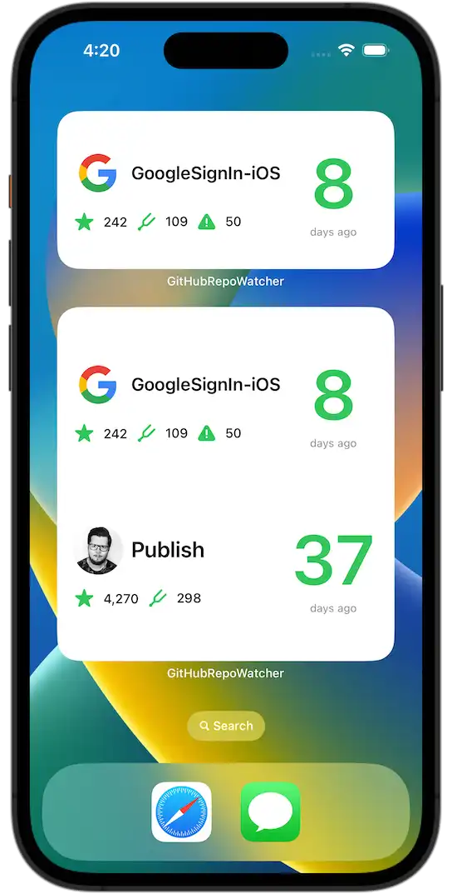
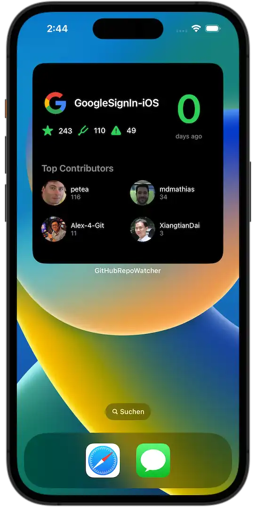
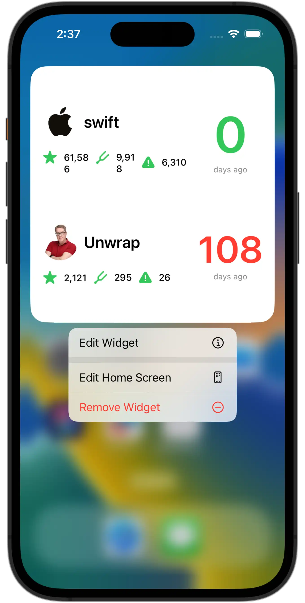
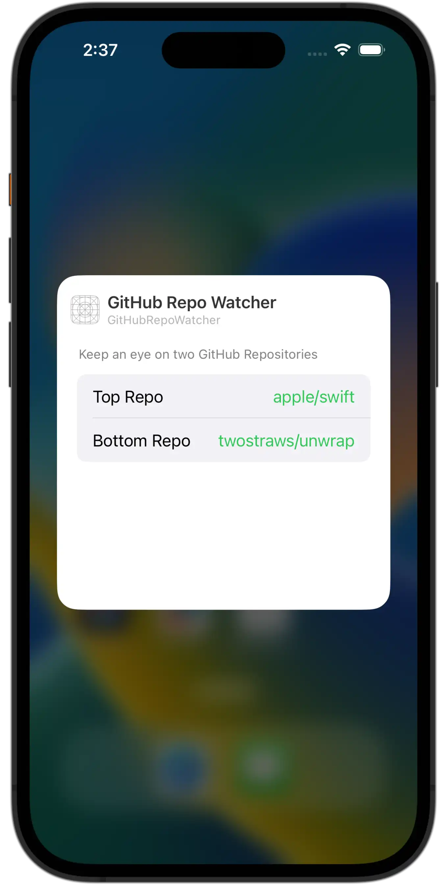
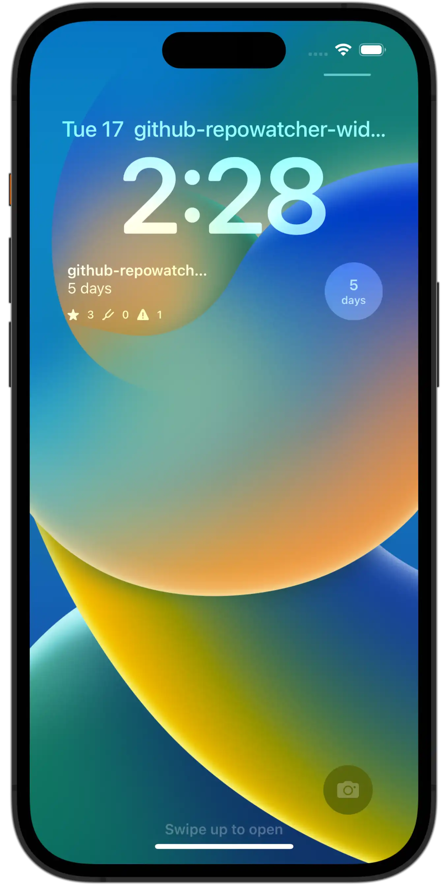
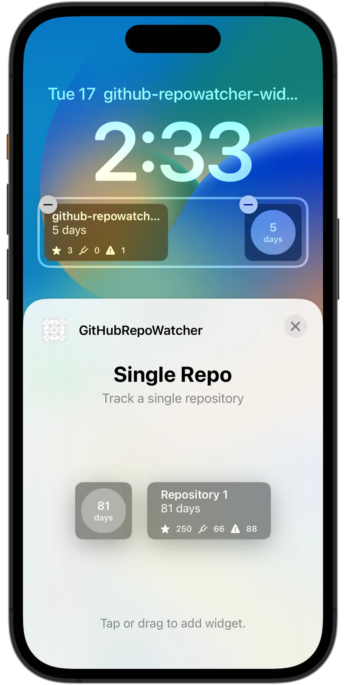
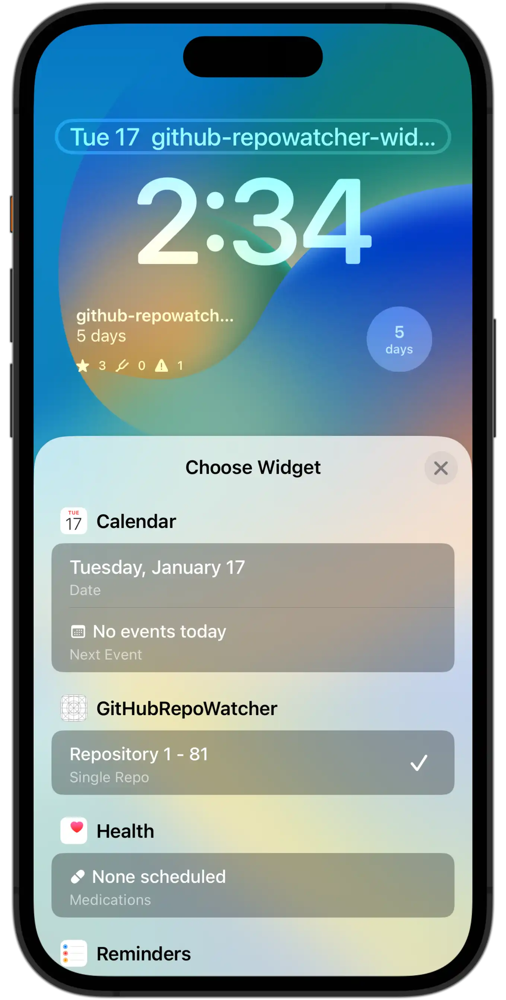
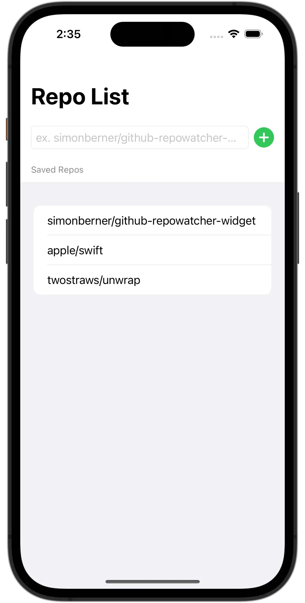

# GitHub Repo Watcher Widget

This is a more advanced iOS16+ widget project to learn how to create a medium and large widget which relies on network calls to update its content.

    
    
    
    
    
    
    
    

---

## Contents
* [Functionality](#functionality)
* [Tech Stack](#tech-stack)
* [Frameworks](#frameworks)
* [Device Compatibility](#device-compatibility)
* [Screenshots](#screenshots)
* [Learnings](#learnings)
* [GitHub API Call](#gitHub-api-call)
* [Testing](#testing)
* [Code Comments](#code-comments)
* [Pull Requests](#pull-requests)
* [Credits](#credits)

---

## Functionality
A medium and large sized Widget that gets a GitHub repository and displays the following infos:
- Owner avatar image
- Repository name
- Days since last pushes
- Number of watchers
- Number of forks
- Number of open issues

A large sized Widget that gets the (top 4) contributors of a GitHub repository and displays the following infos:
- Login name
- Avatar
- Number of contributions made

An App Group is setup among the GitHubRepoWatcher and the RepoWatcherIntents target to share the same UserDefaults database.

## Tech Stack
- Xcode 14.2
- Swift 5.7.2

## Frameworks
- SwiftUI
- [WidgetKit](https://developer.apple.com/documentation/widgetkit)
- [App Intents](https://developer.apple.com/documentation/appintents/)

## Device Compatibility
- iPhone >= iOS16.2+
- iPad >= iOS16.2+

## Screenshots
| Medium/Large Widget | Large Widget |
| :---: | :---: |
|  |  |

| Edit Widget | Widget Intent Configurations |
| :---: | :---: |
|  |  |

| Lock Screen Widgets | Lock Screen Conf |
| :---: | :---: |
|  |  |

| Lock Screen Conf | App Main View |
| :---: | :---: |
|  |  |

## Learnings
- AsyncImage is not working for widgets.
- To chose good useful information to show to a user of a widget is fundamental. A good widget has to show to a user:
    - Glanceable UI Elements
    - Graphical attractive data
    - Quick information
### Widget Gallery
Point of contention:
- Apple recommends giving a Widget some placeholder (mock data) to show it in the Widget Gallery instead of doing any network calls.
(Note: Twitch does network calls in getSnapshot, but probably because of some business reasons)
- But we want to show our users the best representation of our widgets, so how do we do that? Better mock-data?
### Alerts
- Normally there are no error alerts shown to a user in a widget.
    - But there are cases where it makes sense to tell the user an issue (eg. 'Sign in with Google').
    - How you handle errors in Widgets is a unique product decision.
    - To make our lives as developer easier, add log/print statements for debugging errors.
### Network calls
- A successive network call is a network call that relies on a parent network call
### JSON
- [Codable: A type alias for Encodable and Decodable](https://www.swiftbysundell.com/basics/codable/)
- [Ignoring invalid JSON elements when using Codable](https://www.swiftbysundell.com/articles/ignoring-invalid-json-elements-codable/)
### Structured Concurrency
- Async/await: 'try await' is like a guard statement, if it fails nothing is being executed below it (because it falls into the catch block)
### Widget Bundle
- If we have an App with different widget types, we can put them into a [WidgetBundle](https://developer.apple.com/documentation/swiftui/widgetbundle)
### Widget Configurations
- Configurations introduces _(SiriKit) Intents Definitions File_
- 1. Setup an intents definition file
- 1.1 Info: The intent definition file creates lots of code for you (e.g protocols, classes)
- 2. Setup an IntentHandler which is handled in an intents extension target
- 3. Add the App Group as capability to the intents extension target
### Lock Screen Widget
- Is just another small view
- Lock screen widget families are: .accessoryInline, .accessoryRectangular, .accessoryCircular
    
## GitHub API Call
- [Get a repository](https://docs.github.com/en/rest/repos/repos#get-a-repository)

## Testing
I use the [Arrange, Act and Assert Pattern](https://automationpanda.com/2020/07/07/arrange-act-assert-a-pattern-for-writing-good-tests/) for Unit Testing.

## Code Comments
I love putting in the effort of adding comments to my code, [here is why](https://www.youtube.com/watch?v=1NEa-OcsTow).

## Pull Requests
When I create PRs I stick to [this guideline](https://www.youtube.com/watch?v=_sfzAOfY8uc).

## Credits
🙏🏽 Sean Allen

